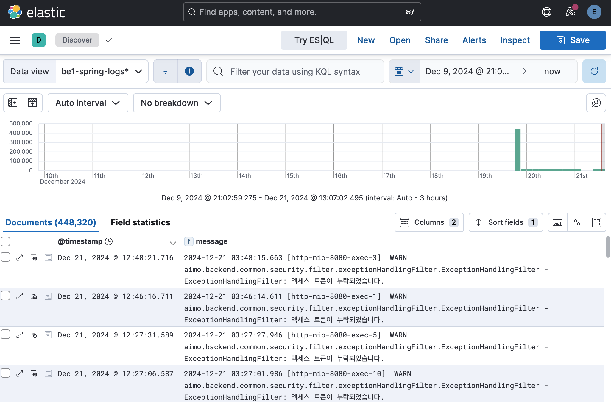
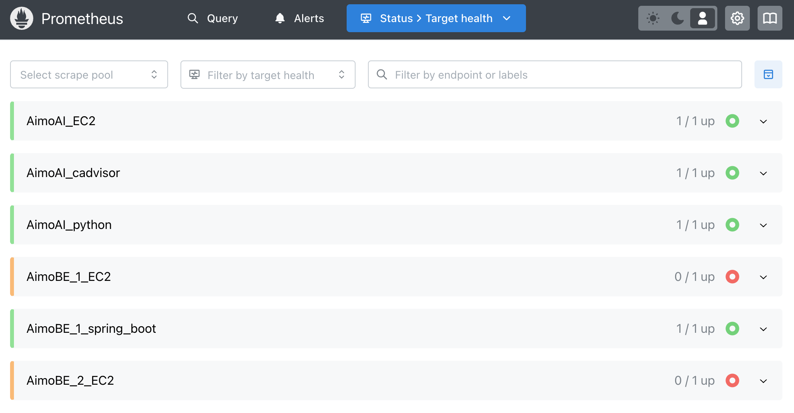

# KTB16-Cloud

클라우드 기반 인프라 구축을 통해 안정적인 서비스 제공과 효율적인 CI/CD 파이프라인을 구현하는 것을 목표로 하는 프로젝트입니다. 본 문서는 프로젝트 아키텍처, 배포 과정, 서비스 흐름, 그리고 로그 및 메트릭 관리 방법을 다룹니다.

---

## 목차

- [클라우드 아키텍처](#1-클라우드-아키텍처)
  - [서비스 진행 과정](#서비스-진행-과정)
  - [주요 구성 요소](#주요-구성-요소)
- [CI/CD 과정](#2-cicd-과정)
  - [FE 서버](#2-1-fe-서버)
  - [BE 서버](#2-2-be-서버)
  - [AI 서버](#2-3-ai-서버)
  - [Monitoring 서버](#2-4-monitoring-서버)
- [ELK-stack](#3-elk-stack)
  - [사전 요구사항](#3-1-사전-요구사항)
  - [배포 요구사항](#3-2-배포-요구사항)
  - [Directory 구조](#3-3-directory-구조)
  - [설치 및 배포](#3-4-설치-및-배포)
  - [서버 접속](#3-5-서버-접속)
- [Prometheus/Grafana](#4-prometheusgrafana)
  - [사전 요구사항](#4-1-사전-요구사항)
  - [배포 요구사항](#4-2-배포-요구사항)
  - [Directory 구조](#4-3-directory-구조)
  - [설치 및 배포](#4-4-설치-및-배포)
  - [서버 접속](#4-5-서버-접속)

---

## 1. 클라우드 아키텍처


### 서비스 진행 과정

1. 사용자가 Route 53을 통해 [ktb-aimo.link](https://ktb-aimo.link) 도메인으로 접속
2. Route 53이 CloudFront로 라우팅하고, CloudFront는 S3에 접근하여 배포된 웹 페이지를 사용자에게 제공
3. 사용자가 웹 페이지를 통해 BE 서버 도메인으로 API 요청을 보냄
4. 사용자의 API 요청이 ALB로 들어오고 ALB는 BE 서버로 API 요청 전달

### 주요 구성 요소

- **Amazon MQ 메시지 브로커**: BE 서버와 AI 서버 간 메시지 전달로 STT 및 OCR 기능 안정화
- **무중단 배포 및 오토스케일링**: 각 서버에 적용
- **로그 및 메트릭 수집**:
  - 각 서버에서 Filebeat 및 Node Exporter를 사용해 로그와 메트릭 수집
  - 수집된 로그는 모니터링 서버의 Logstash에서 가공 후 Elasticsearch로 저장, Kibana에서 대시보드 시각화
  - 수집된 메트릭은 모니터링 서버의 Prometheus와 Grafana로 연결
  - Grafana에서 시스템 성능 및 애플리케이션 메트릭 시각화 및 알림 설정으로 위험 대비

---

## 2. CI/CD 과정

### 2-1. FE 서버

1. GitHub Actions 서버에서 Node.js 설치 및 빌드
2. 빌드 된 파일을 S3에 업로드 후 성공 시 디스코드 알림 전송

### 2-2. BE 서버

1. GitHub Actions 서버에서 Gradle 빌드 수행
2. Gradle된 `server.jar`(빌드된 서버 파일)은 BE 서버에 배포 → 이때 Screen을 이용해 세션 종료 시에도 서버가 유지되도록 설정
   
### 2-3. AI 서버

1. GitHub Actions 서버에서 Docker 이미지를 빌드
2. ECR에 Docker 이미지를 배포
3. ECR에서 EC2로 이미지를 Pull하고 Docker 컨테이너 실행
4. 성공 및 실패시 디스코드 알림 전송
   
### 2-4. Monitoring 서버

1. GitHub Actions를 통해 Docker 이미지를 빌드 및 배포 (예정)

---

## 3. ELK-stack

### 3-1. 사전 요구사항

**구축 환경(동일한 버전 필수)**
   
- Ubuntu
- elasticsearch-8.16.0
- filebeat-8.16.0
- kibana-8.16.0
- logstash-8.16.0

### 3-2. 배포 요구사항

- **AWS EC2 인스턴스**: ELK포트가 허용되도록 보안 그룹 설정(5044, 9200, 5601 - 필요에 따라 추가)
- **Docker**: EC2 인스턴스에 설치 필요. (최신 버전 유지)
- **Docker-Compose**: EC2 인스턴스에 설치 필요. (최신 버전 유지)

  
### 3-3. Directory 구조

```
.
├── elk-stack/                 # Elasticsearch + Logstash + Kibana 구성
│   ├── docker-compose.yml     # ELK만 정의한 Compose 파일
│   ├── elasticsearch/         # Elasticsearch 설정 파일
│   │   └── elasticsearch.yml
│   ├── kibana/                # Kibana 설정 파일
│   │   └── kibana.yml
│   └── logstash/              
│       ├── logstash.yml       # Logstash 설정 파일
│       └── pipeline/
│           └── logstash.conf. # Logstash 파이프라인 설정 파일
```

### 3-4. 설치 및 배포

**1.리포지토리 클론**

```bash
git clone --branch dev https://github.com/KTB16Team/FinalProjectCloud.git .
```

**2. 환경 변수 설정**

`.env` 파일을 생성하여 환경 변수를 설정합니다. 예:

```bash
cd monitoring/ELK-stack
vim .env
```

```bash
ELASTIC_VERSION=8.x(변경해야함)

# Elastic 사용자 비밀번호 (관리자 계정, 모든 권한)
ELASTIC_PASSWORD='changeme'(변경해야함)

# Logstash 사용자 비밀번호 (데이터 전송 및 인덱스 생성 권한)
LOGSTASH_INTERNAL_PASSWORD='changeme'(변경해야함)

# Kibana 사용자 비밀번호 (Kibana에서 Elasticsearch와 통신하는 계정)
KIBANA_SYSTEM_PASSWORD='changeme'(변경해야함)

# Filebeat 사용자 비밀번호 (Filebeat에서 Elasticsearch로 로그 전송 계정)
FILEBEAT_INTERNAL_PASSWORD='changeme'(변경해야함)
```
비밀번호가 6자 미만으로 설정되면 Docker setup 실행 중 실패되므로 6자 이상으로 해야합니다.

**3. Docker Compose 실행(setup → elk 실행)**

```bash
sudo docker-compose --profile=setup up setup
sudo docker-compose up -d
```

Elasticsearch 8.x 이상에서는 보안이 기본 활성화되어 있어서 초기 setup 실행을 하지 않을 경우, 401 Unauthorized, Connection refused 등의 오류가 발생.

**4. 모니터링할 서버안에 filebeat 설치**

1. filebeat가 필요한 ec2에 설치.

```bash
# Filebeat 설치
curl -L -O https://artifacts.elastic.co/downloads/beats/filebeat/filebeat-8.10.0-amd64.deb
sudo dpkg -i filebeat-8.10.0-amd64.deb

# Filebeat 설치 확인
filebeat version
```

2. filebeat.yml 작성

```bash
cd /etc/filebeat/
vim filebeat.yml
```

```yaml
filebeat.inputs:
  # 로그 파일 수집 설정
  - type: log
    enabled: true
    paths:
      - /path/*.log  # 불러올 로그 경로 설정
    multiline.pattern: '^\d{4}-\d{2}-\d{2}' # 로그 시작 포맷 설정(1)
    multiline.negate: true # 로그 멀티라인 수집 설정 필수(2)
    multiline.match: after # 로그 멀티라인 수집 설정 필수(3)
    exclude_lines: ['^DEBUG', '^TRACE'] # 불필요한 로그 제외
    clean_removed: true # 삭제된 로그 파일의 기록을 registry에서 제거
    close_inactive: 5m # 5분 동안 로그 파일에 변화가 없다면 멈춤

output.logstash:
  hosts: ["logstash:5044"]  # Logstash 호스트 주소 설정
  ssl.enabled: false  # SSL 비활성화
```

3. filebeat 실행

```bash
# Filebeat.yml 설정 확인
sudo filebeat test config

# Filebeat 서비스 활성화 및 실행
sudo systemctl enable filebeat
sudo systemctl start filebeat

# Filebeat 실행 확인
sudo systemctl status filebeat
```

4. filebeat와 logstash 연결 확인

- `nc -zv [logstashIP] 5044`

```bash
Connection to [logstashIP] 5044 port [tcp/*] succeeded!
```
        
- `curl -v telnet://[logstashIP]:5044`
        
```bash
*   Trying [logstashIP]:5044...
* Connected to 1[logstashIP] ([logstashIP]) port 5044
```

- `sudo filebeat test config`
- `sudo filebeat test output`
  
```bash
Config OK
logstash: [logstashIP]:5044...
  connection...
    parse host... OK
    dns lookup... OK
    addresses: [logstashIP]
    dial up... OK
  TLS... WARN secure connection disabled
  talk to server... OK
```

위와 같이 뜬다면 연결 성공

### 3-5. 서버 접속

서버가 실행 중이면 [http://[KibanaIP]:5601]로 이동하여 kibana UI에서 확인할 수 있습니다.



---

## 4. Prometheus/Grafana 

### 4-1. 사전 요구사항

**구축 환경(동일한 버전 필수)**

- Ubuntu
- prometheus:latest
- grafana:latest

### 4-2. 배포 요구사항

- **AWS EC2 인스턴스**: Prometheus, Grafana포트가 허용되도록 보안 그룹 설정(3000, 9090 - 필요에 따라 추가)
- **Docker**: EC2 인스턴스에 설치 필요. (최신 버전 유지)
- **Docker-Compose**: EC2 인스턴스에 설치 필요. (최신 버전 유지)

### 4-3. Directory 구조

```
.
├── docker-compose.yml
├── grafana
└── prometheus
    ├── config
    │   ├── prometheus.yml
    └── volume
```

### 4-4. 설치 및 배포

**1.리포지토리 클론**

```bash
git clone --branch dev https://github.com/KTB16Team/FinalProjectCloud.git .
```

**2. Docker Compose 실행**

```bash
sudo chmod -R 777 ./prometheus
sudo chmod -R 777 ./grafana

sudo docker-compose up -d
```

**4. 모니터링할 서버안에 node-exporter 설치**

1. node-exporter가 필요한 ec2에 설치.

```bash
docker run -d \
  --name=node-exporter \
  --net="host" \
  prom/node-exporter
```

### 3-5. 서버 접속

수집하고 있는 메트릭은 [http://[PrometheusIP]:9090]로 이동하여 Prometheus target UI에서 확인할 수 있습니다.



해당 메트릭을 대시보드에 시각화하여 [http://[GrafanaIP]:3000]로 이동하여 Grafana UI에서 확인할 수 있습니다.


---
